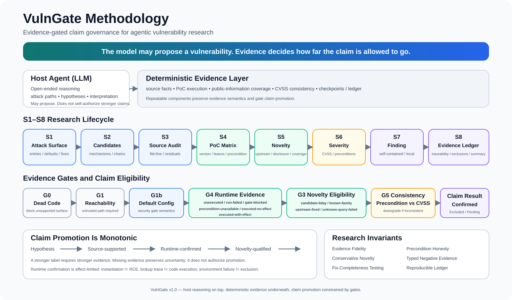

# VulnGate

> **Evidence-gated vulnerability research for AI security agents.**

**Language:** English | [简体中文](README.zh-CN.md)

VulnGate is a Codex-native vulnerability research framework that separates **hypothesis generation** from **claim validation**.

The host agent reads code, reasons about attack paths, and proposes vulnerability hypotheses. Deterministic components collect and validate the evidence required to promote those hypotheses into security claims: reachability, runtime effects, exploit preconditions, public-disclosure novelty, severity consistency, and reproducible research artifacts.

The core principle is simple:

> **The model may propose a vulnerability. Evidence decides how far the claim is allowed to go.**



*VulnGate's methodology: host reasoning proposes hypotheses; deterministic evidence and explicit gates constrain how far a security claim may be promoted.*

VulnGate does not treat *plausible*, *triggered*, *confirmed*, *novel*, and *critical* as interchangeable states. Its S1–S8 research lifecycle and G0–G5 evidence-gate family constrain when a candidate may be promoted into a confirmed vulnerability, a novel finding, or a particular severity level.

## Why VulnGate

LLM-assisted vulnerability research can fail in ways that sound convincing:

- a dangerous call site is mistaken for an exploitable path;
- a PoC harness failure is mistaken for evidence that a bug does not exist;
- object instantiation or a lookup trace is overstated as code execution;
- a rate-limited public search is mistaken for evidence of novelty;
- a vulnerability that requires a non-default feature is scored as if it were reachable by default;
- a security patch is assumed complete without testing residual variants.

VulnGate turns these research disciplines into machine-checkable constraints:

- **No confirmation without runtime evidence.** A claim cannot be promoted to confirmed beyond the runtime effect actually observed.
- **No 0day claim on incomplete public-information queries.** A failed or rate-limited novelty scan produces `unknown-query-failed`, not `candidate-0day`.
- **Hard novelty downgrade on upstream evidence.** A predating issue, PR, fix, or public disclosure covering the same mechanism downgrades the novelty claim.
- **Precondition-honest severity.** CVSS and severity must remain consistent with the actual conditions required to reproduce the issue.
- **Negative evidence is typed.** `unexecuted`, `run-failed`, `gate-blocked`, `precondition-unavailable`, `executed-no-effect`, and `executed-with-effect` are different states and are not interchangeable.
- **Fix completeness is testable.** Security-fix history and residual variants can become first-class candidates instead of being dismissed because a patch exists.

## Research positioning

VulnGate does **not** claim to have invented LLM-assisted vulnerability research, runtime PoC verification, variant analysis, or the broader pattern of combining model reasoning with deterministic security tooling. Those directions have prior public work, including Google Project Zero's Project Naptime / Big Sleep and other agentic security systems.

VulnGate focuses on a narrower question:

> **When an AI security agent participates in vulnerability research, what evidence must exist before a hypothesis is eligible to become a stronger security claim?**

This leads to three design themes:

- **Evidence Fidelity** — conclusions must match the strength and semantics of the evidence actually observed.
- **Claim Eligibility** — labels such as *confirmed*, *novel*, or *0day candidate* require explicit eligibility conditions.
- **Precondition Honesty** — environment, configuration, identity, role, runtime, and other prerequisites remain part of the conclusion instead of being optimized away.

See [RELATED_WORK.md](RELATED_WORK.md) for a non-exhaustive comparison with related systems and [PROVENANCE.md](PROVENANCE.md) for the project's development history and design provenance.

## Architecture at a glance

The host Codex agent owns open-ended reasoning. Bundled deterministic helpers own the parts that must be repeatable and auditable.

```text
Source / runtime
      │
      ▼
Host agent: map → hypothesize → audit → interpret
      │
      ▼
Deterministic evidence collection
      │
      ├─ source evidence / patch variants
      ├─ PoC matrix / execution-state convergence
      ├─ novelty queries / coverage
      ├─ CVSS consistency
      └─ ledger / checkpoints / approval logs
      │
      ▼
Evidence gates
      │
      ▼
Confirmed / Excluded / Candidate (pending validation)
```

Current gate identifiers are **G0, G1, G1b, G3, G4, and G5**; G1b is the default-configuration sub-gate.

## Features

- **Host-native orchestration** — uses the model already configured in Codex; no separate API key is required for the recommended mode.
- **S1–S8 research lifecycle** — attack surface → candidates → source audit → PoC matrix → novelty → severity → finding document → evidence ledger.
- **Deterministic helper CLI** — `agent_cli.py` provides source mapping/evidence, matrix execution, novelty checks, CVSS consistency, ledger rendering, dependency checks, research benchmarking, probe diagnostics, and staging helpers.
- **Version × feature × precondition validation** — PoCs are evaluated across explicit cells rather than a single best-effort run.
- **Stateful/race experiment contract** — cells can declare bounded step sequences, concurrency, and an availability probe; ordered `STEP`/`STATE` evidence is retained without treating declarations as proof.
- **Capability-chain runtime contract** — capability candidates carry a bounded `capability_contract` into S4 cells; `CAPABILITY`/`TRANSITION` traces are classified as `no-trace`, `partial`, or `complete`, while typed effects remain a separate evidence requirement.
- **Runtime research lab** — directed fuzz inputs become fixed corpus fixtures and minimized reproducers; bounded replay and version × SafeMode comparison preserve stable, differential, signature-drift, and precondition-gap evidence without promoting it to a finding.
- **Ordinary-S4 fixture adapter** — Java and shell PoC cells can be replayed as bounded, redacted execution fixtures; `S4/runtime-lab.json` keeps stable replay, version/SafeMode differences, and harness gaps separate from G4/G5.
- **Bounded service context** — stateful S4 runs may start one workspace-local argv-only service, require a loopback health check, reuse a healthy instance, kill the complete process group, and persist `S4/processes.json`; `runtime-lab.json` includes a credential-free configuration snapshot and stable authz/tenant fixture IDs.
- **Cross-round research memory** — S8 persists stable mechanism keys, replay/differential states, environment gaps, and next-probe hints in `state/<target>/research-memory.json`; S2 reuses that evidence to damp exact repeats and prioritize actionable differences without treating memory as a finding.
- **Human review feedback loop** — `agent_cli.py review` records bounded accepted/rejected/needs-evidence/scope-corrected feedback by stable research key; S8 replays it into target memory and S2 uses it only to reprioritize follow-up work, never to replace G4/G5 evidence.
- **Research-quality benchmark** — `agent_cli.py benchmark` scores deterministic gold cases and run records for observation coverage, negative-result safety, environment-gap fidelity, repeat rate, evidence completeness, decision stability, and severity calibration; results remain `not-a-finding`.
- **Benchmark-guided research loop** — `research-benchmark-feedback-v1` turns those metrics into capped alert codes, scheduler-factor deltas, and experiment observations; `schedule --benchmark-result` and explicit target-config opt-in feed the next round without changing findings, CVSS, or G4/G5.
- **Cross-surface research benchmark** — `benchmarks/research-benchmark-surfaces-v1.json` exercises web, protocol, cloud, mobile, and native variants with vulnerable, negative, and environment-gap cases; results preserve `research_profile` and `coverage_by_surface` while keeping unresolved cases pending.
- **Surface-aware adaptation** — weak per-surface benchmark metrics become bounded `surface_guidance`; only explicitly tagged matching candidates receive a small scheduling boost and matching experiment plans receive the required observations/falsifiers.
- **Falsifiable experiment planning** — S2 emits bounded plans with required observations and explicit falsifiers for baseline, authz, state, availability, fix variants, and typed effects; plans remain `not-a-finding`.
- **Capability-primitive path search** — S1 derives bounded `read` / `write` / `exec` / `ssrf` and credential/evaluation chains from the entry/sink/flow indices, preserves missing primitives, and emits minimal verification sequences; static chains remain `not-a-finding` until data-flow and runtime typed-effect evidence exist.
- **Authorization-aware matrices** — web/application candidates can include identity × role × tenant × object context.
- **Per-cell runtime requirements** — a required JDK/runtime must actually be available; otherwise the cell is recorded as `precondition-unavailable` instead of silently falling back.
- **Evidence convergence** — persisted matrix evidence is not overwritten by agent/spawn timeout metadata.
- **Conservative novelty** — public-query failures are preserved as uncertainty rather than converted into absence-of-evidence claims.
- **Fix-completeness analysis** — recent security fixes, patch variants, and residuals can feed new validation candidates.
- **Checkpointed evidence ledger** — research state and evidence are persisted so the final report is traceable to artifacts.
- **Safety-first execution** — loopback-first PoC behavior, explicit approval logging, and allowlisted staging support.

## Coverage-driven auditing and native applications

Version 1.1.0 extends the Codex plugin with a broader deterministic analysis
layer and native-application support. The host uses your configured Codex model;
the new deterministic commands require no additional model API key.

- Full production-source inventory with explicit skipped-file reasons and
  ledger-derived review coverage.
- Heuristic symbols, call graphs and forward/backward entry-to-sink paths.
- Per-path control gaps and sibling-handler differentials, with candidates
  retained as leads until verified.
- Capability-primitive graphs and explicit attack-chain equations that retain
  missing intermediate capabilities instead of promoting static composition to RCE.
- Candidate scoring and category quotas that preserve deferred work across rounds.
- macOS `.app`/`.dmg`/`.pkg`, Mach-O metadata, Electron ASAR/source maps and JAR views.

```bash
python3 scripts/agent_cli.py coverage demo --root /path/to/source \
  --workspace /path/to/audit --rebuild --show-uncovered
python3 scripts/agent_cli.py controls demo --workspace /path/to/audit --show-candidates
python3 scripts/agent_cli.py differential demo --workspace /path/to/audit --show-candidates
python3 scripts/agent_cli.py capability demo --workspace /path/to/audit --show-candidates
python3 scripts/agent_cli.py benchmark --manifest benchmarks/research-benchmark-v1.json \
  --run benchmarks/research-benchmark-sample-run.json \
  --feedback-out state/research-benchmark-feedback.json --json
bash macos/run-audit.sh /Applications/Target.app /path/to/native-audit
```

Use the same `--workspace` for analysis, scheduling and ledger commands. Rebuild
coverage when source or scope changes. Native reconstruction establishes an
attack-surface view; it does not recover method bodies or prove vulnerabilities.
See [native-target usage](macos/README.md) and
[feature evolution notes](docs/EVOLUTION.md).

## Installation

### Prerequisites

- Codex (CLI or desktop app), version with plugin support
- Python 3.8+
- JDK 8+ for JVM targets (17/21 recommended); native targets require macOS Command Line Tools
- `rg` (ripgrep) for source mapping

### Install from this repository

```bash
git clone https://github.com/xingchen20lj/vulngate.git
cd vulngate
./install.sh
```

`install.sh` copies the plugin to `~/plugins/vulngate`, registers the personal marketplace, and enables it in Codex (`codex plugin add vulngate@personal`). It searches for the `codex` command in `$PATH` and in supported desktop-app locations.

> **Open a new thread after installation.** Plugin skills are loaded at thread start.

For an existing installation, rerun `./install.sh` to update it. The installer
preserves compatibility aliases for older versioned skill-cache paths, so an
audit task that is already running does not lose its `SKILL.md` during the
update. Avoid running a bare `codex plugin add vulngate@personal` while an audit
task is active.

### Manual install

```bash
codex plugin add vulngate@personal
```

If you prefer CLI-only Codex:

```bash
npm install -g @openai/codex
```

See [docs/QUICKSTART.md](docs/QUICKSTART.md) for installation troubleshooting and the full walkthrough.

## Quickstart

Start a new Codex thread and point VulnGate at the authorized source tree:

> Audit this codebase and run the full S1→S8 research pipeline: `/path/to/source`

The host agent maps the attack surface, proposes candidates, audits source, runs evidence-oriented validation cells, checks public novelty, validates severity consistency, and produces local research artifacts.

For an autonomous run using your own compatible LLM API key:

```bash
./scripts/run_pipeline.sh --name <target> --target-dir <path> --round 1
```

## How it works

| Stage | Purpose | Representative outputs | Gate |
|---|---|---|---|
| S1 | Attack-surface mapping, entry inventory, danger sites, fix history/variants, project profile, target rules, composite-chain and capability candidates | `S1/entry-inventory.json`, `S1/security-fix-history.json`, `S1/patch-variants.json`, `S1/project-profile.json`, `S1/target-rules.json`, `S1/composite-chain-candidates.json`, `S1/capability-graph.json`, `S1/capability-candidates.json` | G0 dead code, G1 reachability |
| S2 | Candidate matrix and falsifiable research plans: surface × entry × input × mechanism | `S2/candidate-matrix.json`, `S2/experiment-plans.json` | — |
| S3 | Source audit with file:line evidence, source-to-sink hints, residuals | `S3/audit-notes.json`, `S3/residuals.json` | G1b default-config gating |
| S4 | PoC matrix: version × safe mode × precondition; optional authz, bounded state/concurrency, capability-transition context, replay/differential lab, and loopback service lifecycle | `S4/matrix-runs/<c>/cells.json`, `S4/execution-status.json`, `S4/authz-matrix.json`, `S4/runtime-lab.json`, `S4/processes.json` | G4 runtime evidence |
| S5 | Novelty: upstream issue/PR/fix + public disclosure search and coverage | `S5/novelty.json`, `S5/novelty-coverage.json` | G3 novelty / downgrade |
| S6 | CVSS + precondition/impact consistency | `S6/severity.json` | G5 consistency |
| S7 | Self-contained local finding document | `reports/<target>/…` | disclosure hold |
| S8 | Evidence ledger, exclusions, round summary, cross-round research memory and review feedback | `ledger/<target>/…`, `state/<target>/research-memory.json`, `state/<target>/review-feedback.json`, `S8/research-memory.json`, `S8/review-feedback.json` | final consistency checks |

The source-to-sink graph is intentionally conservative: heuristic proximity is marked as `heuristic-nearby` and `requires_manual_dataflow=true`; it is not presented as a substitute for sound semantic data-flow analysis.

See [docs/ARCHITECTURE.md](docs/ARCHITECTURE.md) and [docs/AUDIT-PLAYBOOK.md](docs/AUDIT-PLAYBOOK.md) for details.
The implementation roadmap is in [docs/RESEARCH-ROADMAP.zh-CN.md](docs/RESEARCH-ROADMAP.zh-CN.md).

## Safety and disclosure

VulnGate is intended for authorized security research.

- Local PoC side effects are loopback-first (`127.0.0.1`).
- Non-loopback egress, listeners, remote tooling, and staging actions are policy-controlled and logged.
- Explicitly authorized staging requires an allowlisted host; public listeners and third-party targets remain out of scope.
- Staging preparation artifacts are environment records, not vulnerability evidence by themselves.
- Findings are generated locally and are not automatically published.
- Coordinate responsibly with maintainers before public disclosure.

Report vulnerabilities in VulnGate itself through [SECURITY.md](SECURITY.md).

## Development, provenance, and contribution

VulnGate is independently designed and maintained by **xingchen20lj** with AI-assisted development using ChatGPT and Codex. AI tools are used as implementation and design aids; project decisions are tested against real audit behavior and encoded into deterministic rules and regression tests.

The public Git history starts with VulnGate 0.1.0 on 2026-08-09. Subsequent commits record audit-driven changes such as Metabase-run lessons, fix-completeness gates, spawn diagnostics, patch-variant analysis, novelty-query failure preservation, and S4 evidence convergence/runtime isolation.

This history is evidence of project evolution, not a claim that every broad idea used by VulnGate originated here. See [PROVENANCE.md](PROVENANCE.md), [CHANGELOG.md](CHANGELOG.md), and [RELATED_WORK.md](RELATED_WORK.md).

Developer quick reference:

- `scripts/smoke_test.sh` — environment and deterministic-helper smoke tests
- `.codex-plugin/plugin.json` — plugin manifest
- `skills/vulngate-audit/SKILL.md` — host-agent execution contract
- `scripts/agent/` — bundled deterministic framework
- `CHANGELOG.md` — versioned design evolution

Local iteration:

```bash
./install.sh
```

Then start a new thread. Contribution guidance is in [CONTRIBUTING.md](CONTRIBUTING.md).

## License

MIT — see [LICENSE](LICENSE).
