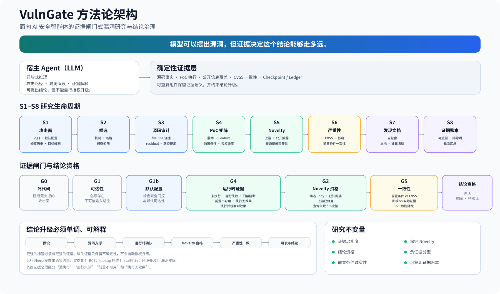

# VulnGate

> **面向 AI 安全智能体的证据闸门式漏洞研究框架。**

**语言：** [English](README.md) | 简体中文

VulnGate 是一套 Codex 原生的漏洞研究框架，它将**漏洞假设生成**与**安全结论裁决**明确分离。

宿主 Agent 负责阅读源码、分析攻击路径并提出漏洞假设；确定性组件负责收集和校验能够支撑结论的证据，包括可达性、运行时效果、利用前置条件、公开披露与 Novelty、严重性一致性，以及可复现的研究产物。

VulnGate 的核心原则很简单：

> **模型可以提出漏洞，但证据决定这个结论能够走多远。**



*VulnGate 方法论：宿主 Agent 负责提出假设；确定性证据与显式闸门约束安全结论能够升级到什么程度。*

在 VulnGate 中，“看起来可能存在”“触发了某种行为”“漏洞已确认”“属于新漏洞”以及“高危/严重”不是可以相互替代的描述。S1–S8 研究生命周期和 G0–G5 证据闸门体系会约束一个候选在什么条件下才能升级为已确认漏洞、Novel Finding 或特定严重等级。

## 为什么需要 VulnGate

LLM 辅助漏洞研究很容易出现“听起来合理、证据却不够”的结论：

- 看到了危险调用点，就被误认为存在可利用路径；
- PoC harness 或环境失败，被误认为漏洞不存在；
- 仅观察到对象实例化或 lookup 行为，就被夸大成代码执行；
- 公开信息查询被限流，却被误当成“没有公开记录”；
- 漏洞依赖非默认 Feature，却按默认可达路径给出严重等级；
- 看见安全补丁存在，就默认修复已经完整覆盖所有变体。

VulnGate 将这些研究纪律固化为机器可检查的约束：

- **没有运行时证据，不得越级确认。** 安全结论只能升级到实际观察到的运行时效果所能支撑的强度。
- **公开信息查询不完整，不得声称 0day。** 查询失败或被限流时，Novelty 结论为 `unknown-query-failed`，而不是 `candidate-0day`。
- **上游已有同机制证据时强制降级。** 早于发现时间的 issue、PR、修复或公开披露命中同机制时，必须降低 Novelty 声称。
- **前置条件必须诚实保留。** CVSS 与严重等级必须与实际复现条件保持一致。
- **负面证据具有明确语义。** `unexecuted`、`run-failed`、`gate-blocked`、`precondition-unavailable`、`executed-no-effect` 与 `executed-with-effect` 是不同状态，不能相互替代。
- **修复完整性可以被验证。** 安全修复历史、patch variant 与 residual 可以成为一等候选，而不是因为“补丁已经存在”就直接排除。

## 研究定位

VulnGate **不主张** LLM 辅助漏洞研究、运行时 PoC 验证、variant analysis，或“模型推理 + 确定性工具验证”这一广义方向由本项目首创。这些方向已有公开先行工作，包括 Google Project Zero 的 Project Naptime / Big Sleep，以及其他 agentic security research 系统。

VulnGate 更关注一个进一步的问题：

> **当 AI 安全 Agent 自主参与漏洞研究时，在什么证据条件下，它才有资格把一个 hypothesis 升级为更强的安全结论？**

这形成了三个核心设计主题：

- **Evidence Fidelity（证据忠实度）** —— 结论必须与实际证据的强度和语义一致。
- **Claim Eligibility（结论资格）** —— *confirmed*、*novel*、*0day candidate* 等标签必须满足显式资格条件。
- **Precondition Honesty（前置条件诚实性）** —— 环境、配置、身份、角色、运行时等先决条件必须保留在结论中，不能为了得到更强结论而被忽略。

相关系统对比见 [RELATED_WORK.md](RELATED_WORK.md)，项目研发演进与溯源说明见 [PROVENANCE.md](PROVENANCE.md)。

## 架构速览

宿主 Codex Agent 负责开放式推理；插件捆绑的确定性组件负责必须可重复、可审计的步骤。

```text
源码 / 运行环境
      │
      ▼
宿主 Agent：测绘 → 假设 → 审计 → 解释
      │
      ▼
确定性证据收集
      │
      ├─ 源码证据 / patch variants
      ├─ PoC 矩阵 / execution-state convergence
      ├─ Novelty 查询 / coverage
      ├─ CVSS consistency
      └─ ledger / checkpoint / approval log
      │
      ▼
Evidence Gates
      │
      ▼
确认 / 排除 / 候选（待验证）
```

当前使用的闸门标识为 **G0、G1、G1b、G3、G4、G5**，其中 G1b 是默认配置子闸门。

## 功能特性

- **宿主原生编排** —— 推荐模式直接使用 Codex 中已配置的模型，无需额外 API Key。
- **S1–S8 研究生命周期** —— 攻击面 → 候选 → 源码审计 → PoC 矩阵 → Novelty → 严重性 → 发现文档 → Evidence Ledger。
- **确定性助手 CLI** —— `agent_cli.py` 提供 source mapping/evidence、矩阵运行、Novelty、CVSS 一致性、账本、依赖检查、研究评测、spawn 诊断与 staging helpers。
- **版本 × Feature × 前置条件验证** —— PoC 以显式 cell 矩阵运行，而不是单次 best-effort 测试。
- **授权边界矩阵** —— Web/应用类候选可加入身份 × 角色 × 租户 × 对象维度。
- **可证伪实验规划** —— S2 为基线、授权、有状态、可用性、修复变体和 typed effect 生成带必需观测/证伪条件的有界计划；计划保持 `not-a-finding`，不会冒充漏洞结论。
- **真实项目回放校准** —— `agent_cli.py replay-calibrate` 与 S8 从有界 guidance、strategy-feedback 和 runtime-lab 历史生成 `research-replay-calibration-v1`；替换命中率、无信息重复、环境恢复、fixture 截断和 comparison gap 只可调整有界的零增益阈值（1–2 轮），不会改变漏洞结论、CVSS 或 G4/G5。
- **跨项目回放 cohort 校准** —— `agent_cli.py replay-cohort-calibrate` 汇聚操作者显式提供的多个目标回放 artifact，并检查不同项目数与研究面样本是否足够；显式配置的 cohort 只在目标本地历史不足时作为 fallback，始终是 `not-a-finding` 的调度元数据。
- **带 provenance 的回放 pack** —— `agent_cli.py replay-pack` 与 S8 只保存 allowlist workspace-local artifact 的哈希和有界 lane/comparison 摘要；`replay-cohort-calibrate --pack` 只接受来源完整且自洽的 pack，缺失或被修改的 artifact 保持为明确的 provenance 缺口。
- **跨轮证据一致性** —— `research-consistency-v1` 比较同一机制在多轮中的有界 research-memory 事件，识别 effect/reproduction/comparison/context 漂移，并把矛盾转成受控复核；它不会把矛盾或环境缺口升级为漏洞结论。
- **受控一致性复核** —— `research-consistency-action-v1` 将非一致历史物化为固定隔离轴、正/负向 lane、required observations、falsifiers 和 S2 `consistency-recheck` 计划；S4 会在 MatrixCell、PoC 环境和 runtime-lab fixture 中传递该契约，但始终保持 `not-a-finding`。
- **能力原语与攻击路径图** —— S1 从 entry/sink/flow 索引生成有界 `read` / `write` / `exec` / `ssrf` 等能力链候选，区分已观察与缺失原语，并自动生成最小验证序列；链路始终保持 `not-a-finding`，等待数据流与运行时 typed effect 证据。
- **语义路径证据** —— S1 增加 `semantic-path-evidence-v1`，检查路径控制是否位于 sink 之前且处于同一语义块，并在同一符号内做有界的参数/别名数据流追踪；跨符号、分支支配和类型语义继续保留为研究缺口，所有线索仍是 `not-a-finding`。
- **语义守卫证据** —— S1 增加 `semantic-guard-evidence-v1`，记录有限的拒绝分支姿态和 subject/object 绑定（`terminating-guard`、`nested-branch`、`non-branch-check`、`overlap`、`mismatch`、`unresolved`），用于优先安排授权/逻辑复核，但不把词法证据当作分支支配或对象身份证明。
- **跨符号绑定证据** —— S1 增加 `semantic-call-evidence-v1`，按一跳调用记录参数到形参的绑定、污点参数传递和返回形状提示；未解析的 dispatch、arity、变换和 sink 绑定继续保留为可引用的研究缺口，不把静态数据流升级为结论。
- **控制流证据** —— S1 增加 `semantic-controlflow-evidence-v1`，记录可能支配 sink 的守卫、`else`/`except` 备用路径和同块普通检查；完整 CFG、异常、循环和路径可行性仍明确保留为研究缺口。
- **Python AST 结构证据** —— S1 增加 `semantic-ast-evidence-v1`，对 Python 文件确认语法树作用域、终止守卫形状、`else`/异常备用路径和解析缺口；它仍是有界结构见证，不是完整 CFG 或漏洞结论。
- **语义变换绑定证据** —— S1 增加 `semantic-transform-evidence-v1`，对校验/清洗调用的结果做有界绑定追踪，区分结果真正到达 sink、被丢弃、被覆盖和未解析；它是研究线索，不是 sanitizer 语义证明或漏洞结论。
- **能力链运行时契约** —— 能力候选会把有界 `capability_contract` 传入 S4 cell；`CAPABILITY`/`TRANSITION` 轨迹会被分类为 `no-trace`、`partial` 或 `complete`，终点 typed effect 仍单独要求真实证据。
- **运行时研究实验室** —— 定向 fuzz 输入会固化为 corpus fixture 和缩减 reproducer；有界重放与版本 × SafeMode 对照会保留稳定性、差分、签名漂移和前置缺口证据，但不会直接升级为漏洞结论。
- **普通 S4 fixture 适配器** —— Java 与 Shell PoC cell 可固化为脱敏执行 fixture 并有界重放；`S4/runtime-lab.json` 将稳定性、版本/SafeMode 差异和 harness 缺口与 G4/G5 结论分开。
- **研究面 lane witness** —— `surface-variant-evidence-v1` 将真实 S4 runner row 与 lane 契约对照，区分 observed/partial/environment-gap/not-executed 覆盖，并把有界缺失信号回写到 S2/S8，不改变漏洞结论、CVSS 或 G4/G5。
- **跨轮研究面覆盖** —— `surface-variant-coverage-v1` 在 project portfolio 中汇聚 lane witness 的历史与最新状态；只有最新真实状态为 `observed` 才闭合，partial/not-executed/environment-gap 会按精确 research key 生成下一轮 probe。
- **受控 source-revision arm** —— 操作者可通过 `source_revision_artifacts` 为精确的 before/after commit ref 提供 workspace 内 `.jar`/`.war`/`.zip`；VulnGate 只做校验、指纹和隔离 Java 矩阵执行，不 checkout、不构建源码，缺失或无效产物始终记录为明确的不可判定缺口。
- **跨轮研究记忆** —— S8 将稳定机制键、重放/差分状态、环境缺口、受限的 S3 residual 元数据和 next probe 写入 `state/<target>/research-memory.json`；即使主 replay 已稳定，残余变体仍保持 pending，S2 也不会把记忆升级成漏洞结论。
- **人工复核反馈闭环** —— `agent_cli.py review` 按稳定 research key 记录 accepted/rejected/needs-evidence/scope-corrected；S8 回放到目标记忆，S2 只据此调整后续优先级，不替代 G4/G5。
- **研究质量评测基准** —— `agent_cli.py benchmark` 对 gold case/run 计算观测覆盖、负向安全、环境缺口保真度、重复率、证据完整度、决策稳定性和严重性校准；结果保持 `not-a-finding`。
- **评测驱动研究闭环** —— `research-benchmark-feedback-v1` 将指标转换为有界告警、调度因子微调和实验观测提示；`schedule --benchmark-result` 或目标配置显式接入下一轮，但不会改变漏洞结论、CVSS 或 G4/G5。
- **跨攻击面研究基准** —— `benchmarks/research-benchmark-surfaces-v1.json` 覆盖 Web、协议、云、移动端和 native 变体，并分别测试可确认、负向与环境缺口；结果保留 `research_profile` 与 `coverage_by_surface`，未满足运行条件的 case 仍保持 pending。
- **按研究面自适应** —— 研究面级指标会生成有界 `surface_guidance`；只有显式标注且匹配的候选才会获得小幅调度优先级，匹配的实验计划才会追加对应的必需观测与证伪条件。
- **纵向评测退化检测** —— `benchmark --baseline <result.json>` 对比多轮有界聚合指标与研究面指标，将退化保存为 `research-benchmark-trend-v1`，不复制 case 证据，也不会升级为漏洞结论。
- **项目级研究组合** —— S8 将研究记忆、人工复核、评测上下文和受限 S3 residual 汇聚为有界 `research-portfolio-v1`，按研究面、攻击类别、变体和前置条件展示覆盖与缺口，并输出 residual-aware `next_probes`；调度器只对精确匹配的待验证探针做小幅排序提示，组合统计保持 `not-a-finding`。
- **攻击路径威胁模型** —— S1 将入口、信任边界、flow、sink、控制姿态、未解析可达性和能力链假设关联成有界 `threat-model-v1`；调度器与 `agent_cli.py threat-model` 可查看这张研究地图，但不会把它升级成漏洞结论。
- **证据驱动研究策略** —— S2 将威胁模型、residual、跨轮记忆、项目组合缺口和评测上下文汇聚为有界 `research-strategy-v1`，每条策略带 required observations 与 falsifiers；只有明确的路径或 research-key 匹配才获得小幅排序提示，所有策略仍保持 `not-a-finding`。
- **逐 cell 运行时前置** —— 声明需要的 JDK/runtime 必须真实可用，否则记录 `precondition-unavailable`，不会静默使用其他运行时替代。
- **S4 证据收敛** —— 已落盘矩阵证据不会被 Agent/spawn 超时元数据覆盖。
- **保守 Novelty** —— 公开查询失败会保留为不确定状态，而不会被转化为“未发现公开记录”。
- **修复完整性分析** —— 近期安全修复、patch variant 与 residual 可继续进入验证流程。
- **Checkpoint + Evidence Ledger** —— 研究状态、证据与最终结论之间保持可追溯关系。
- **安全优先执行边界** —— 回环优先、审批留痕，并支持显式授权且白名单化的 staging。

## 覆盖率驱动审计与原生应用

1.1.0 为 Codex 原生插件扩展了更完整的确定性分析层和原生应用支持。
宿主继续使用 Codex 当前模型，新增确定性命令无需额外模型 API Key。

- 完整生产源码清单，显式记录跳过原因，从审计账本推导覆盖状态。
- 启发式符号、调用图，以及入口到 sink 的正向/反向路径。
- 逐路径安全控制缺口和同族 handler 差分；产出候选线索，等待验证。
- 独立的语义路径证据索引：控制顺序、语义块关系和同符号参数/别名可达性；结果会作为 S2 研究候选，但不会冒充严格数据流证明。
- 有界的语义守卫证据索引：分支姿态与 subject/object 绑定；结果单独落盘并作为 `not-a-finding` 的 S2 研究候选。
- 有界的一跳跨符号参数/返回绑定证据：把 source→sink 的跨过程缺口转成可引用的人工追踪任务，并明确保留未解析 dispatch 与变换缺口。
- 有界的控制流关系证据：区分可能支配、备用分支和同块未验证检查；可能支配只是复核信号，不是证明。
- 能力原语图与显式攻击链方程；保留缺失中间能力，不把静态组合直接升级为 RCE。
- 按证据评分、类别配额调度候选，延期工作保留到后续轮次。
- macOS `.app`/`.dmg`/`.pkg`、Mach-O 元数据、Electron ASAR/source map 与 JAR 视图。

```bash
python3 scripts/agent_cli.py coverage demo --root /path/to/source \
  --workspace /path/to/audit --rebuild --show-uncovered
python3 scripts/agent_cli.py controls demo --workspace /path/to/audit --show-candidates
python3 scripts/agent_cli.py differential demo --workspace /path/to/audit --show-candidates
python3 scripts/agent_cli.py capability demo --workspace /path/to/audit --show-candidates
python3 scripts/agent_cli.py semantic-paths demo --workspace /path/to/audit --show-candidates
python3 scripts/agent_cli.py semantic-guards demo --workspace /path/to/audit --show-candidates
python3 scripts/agent_cli.py semantic-calls demo --workspace /path/to/audit --show-candidates
python3 scripts/agent_cli.py semantic-controlflow demo --workspace /path/to/audit --show-candidates
python3 scripts/agent_cli.py semantic-ast demo --workspace /path/to/audit --show-candidates
python3 scripts/agent_cli.py semantic-transforms demo --workspace /path/to/audit --show-candidates
python3 scripts/agent_cli.py benchmark --manifest benchmarks/research-benchmark-v1.json \
  --run benchmarks/research-benchmark-sample-run.json \
  --feedback-out state/research-benchmark-feedback.json --json
bash macos/run-audit.sh /Applications/Target.app /path/to/native-audit
```

分析、调度和账本命令使用同一个 `--workspace`。源码或范围变化后重新构建覆盖索引。
原生重建只建立攻击面视图，不能恢复方法体或直接证明漏洞。
详见 [原生目标使用说明](macos/README.md) 和
[功能演进说明](docs/EVOLUTION.md)，能力升级路线见
[研究能力升级路线图](docs/RESEARCH-ROADMAP.zh-CN.md)。

## 安装

### 前置要求

- Codex（CLI 或桌面客户端），支持插件的版本
- Python 3.8+
- JVM 目标需要 JDK 8+（推荐 17/21）；原生 macOS 目标需要 Command Line Tools
- `rg`（ripgrep），用于源码测绘

### 从本仓库安装

```bash
git clone https://github.com/xingchen20lj/vulngate.git
cd vulngate
./install.sh
```

`install.sh` 会把插件复制到 `~/plugins/vulngate`、注册个人 marketplace，并在 Codex 中启用（`codex plugin add vulngate@personal`）。脚本会自动从 `$PATH` 和支持的桌面应用路径中寻找 `codex`。

> **安装后必须新建线程。** 插件技能在线程启动时加载。

已有安装需要更新时，请重新执行 `./install.sh`。安装脚本会为旧版缓存路径
保留兼容别名，避免更新期间正在运行的审计任务丢失 `SKILL.md`。审计任务运行
时不要直接执行单独的 `codex plugin add vulngate@personal`。

### 手动安装

```bash
codex plugin add vulngate@personal
```

如果只想使用 CLI 版 Codex：

```bash
npm install -g @openai/codex
```

完整安装排障与走查见 [docs/QUICKSTART.zh-CN.md](docs/QUICKSTART.zh-CN.md)。

## 快速开始

新建 Codex 线程，并把 VulnGate 指向你有权审计的源码目录：

> 审计这个代码库，跑完整的 S1→S8 研究流程：`/path/to/source`

宿主 Agent 会测绘攻击面、提出候选、审计源码、执行面向证据的验证矩阵、检查公开 Novelty、校验严重性一致性，并生成本地研究产物。

如需使用自己的兼容 LLM API Key 无人值守运行：

```bash
./scripts/run_pipeline.sh --name <target> --target-dir <path> --round 1
```

## 工作原理

| 阶段 | 目的 | 代表性输出 | 闸门 |
|---|---|---|---|
| S1 | 攻击面、入口、危险调用点、修复历史/变体、项目画像、目标类型规则、复合攻击链、能力原语、语义路径/守卫/调用/控制流/AST/变换绑定证据与攻击路径威胁模型 | `S1/entry-inventory.json`、`S1/security-fix-history.json`、`S1/patch-variants.json`、`S1/project-profile.json`、`S1/target-rules.json`、`S1/composite-chain-candidates.json`、`S1/capability-graph.json`、`S1/capability-candidates.json`、`S1/semantic-path-evidence.json`、`S1/semantic-path-candidates.json`、`S1/semantic-guard-evidence.json`、`S1/semantic-guard-candidates.json`、`S1/semantic-call-evidence.json`、`S1/semantic-call-candidates.json`、`S1/semantic-controlflow-evidence.json`、`S1/semantic-controlflow-candidates.json`、`S1/semantic-ast-evidence.json`、`S1/semantic-ast-candidates.json`、`S1/semantic-transform-evidence.json`、`S1/semantic-transform-candidates.json`、`S1/threat-model.json` | G0 死代码、G1 可达性 |
| S2 | 候选矩阵、可证伪研究计划、受控一致性复核与跨产物研究策略：surface × entry × input × mechanism | `S2/candidate-matrix.json`、`S2/experiment-plans.json`、`S2/research-strategy.json` | — |
| S3 | 带 file:line 证据的源码审计、Source→Sink hints、residuals | `S3/audit-notes.json`、`S3/residuals.json` | G1b 默认配置门控 |
| S4 | PoC 矩阵：版本 × safe mode × 前置条件；可选 authz、有界状态/并发、能力 transition、一致性复核契约与重放/差分实验室 | `S4/matrix-runs/<c>/cells.json`、`S4/execution-status.json`、`S4/authz-matrix.json`、`S4/runtime-lab.json` | G4 运行时证据 |
| S5 | Novelty：上游 issue/PR/fix + 公开披露搜索与覆盖记录 | `S5/novelty.json`、`S5/novelty-coverage.json` | G3 Novelty / 强制降级 |
| S6 | CVSS + 前置条件/影响一致性 | `S6/severity.json` | G5 一致性 |
| S7 | 自包含本地发现文档 | `reports/<target>/…` | 披露冻结 |
| S8 | Evidence Ledger、排除项、轮次汇总、跨轮研究记忆与一致性、受控复核动作、人工复核和项目级研究组合 | `ledger/<target>/…`、`state/<target>/research-memory.json`、`state/<target>/coverage/research-consistency.json`、`state/<target>/coverage/research-consistency-actions.json`、`state/<target>/review-feedback.json`、`state/<target>/research-portfolio.json`、`S8/research-memory.json`、`S8/research-consistency.json`、`S8/research-consistency-actions.json`、`S8/research-portfolio.json` | 最终一致性检查 |

Source→Sink 图刻意保持保守：启发式邻近路径会明确标记为 `heuristic-nearby` 与 `requires_manual_dataflow=true`，不会冒充严格语义数据流证明。包含授权边界和危险 Sink 的路径会进一步生成 `chain-*` S2 候选，交给源码审计和授权/效果矩阵验证，而不是停留在提示文件中。

详细设计见 [docs/ARCHITECTURE.zh-CN.md](docs/ARCHITECTURE.zh-CN.md) 与 [docs/AUDIT-PLAYBOOK.md](docs/AUDIT-PLAYBOOK.md)。

## 安全与披露

VulnGate 面向经过授权的安全研究。

- 本地 PoC 副作用以回环（`127.0.0.1`）为默认边界。
- 非回环外联、监听、远程工具与 staging 动作均受策略控制并留痕。
- 显式授权 staging 必须使用主机白名单；公网监听和第三方目标仍不在范围内。
- staging 环境准备记录本身不等于漏洞证据。
- 发现文档只在本地生成，不会自动对外发布。
- 对外披露前应与维护者进行负责任协调。

本插件自身漏洞请按 [SECURITY.zh-CN.md](SECURITY.zh-CN.md) 报告。

## 开发、溯源与贡献

VulnGate 由 **xingchen20lj** 独立设计和维护，开发过程中使用 ChatGPT 与 Codex 进行 AI-assisted development。AI 工具作为实现和设计辅助；关键研究决策通过真实审计行为进行验证，并逐步固化为确定性规则与回归测试。

公开 Git 历史从 2026-08-09 的 VulnGate 0.1.0 开始。后续提交持续记录由实际审计暴露的问题，例如 Metabase 审计轮次经验、fix-completeness gate、spawn 诊断、patch variant analysis、Novelty 查询失败保留，以及 S4 evidence convergence/runtime isolation。

这条历史用于说明项目如何演化，并不主张 VulnGate 使用的所有广义思想都起源于本项目。详见 [PROVENANCE.md](PROVENANCE.md)、[CHANGELOG.md](CHANGELOG.md) 与 [RELATED_WORK.md](RELATED_WORK.md)。

开发者快速参考：

- `scripts/smoke_test.sh` —— 环境与确定性助手冒烟测试
- `.codex-plugin/plugin.json` —— 插件清单
- `skills/vulngate-audit/SKILL.md` —— 宿主 Agent 执行契约
- `scripts/agent/` —— 捆绑的确定性框架
- `CHANGELOG.md` —— 版本化设计演进

本地迭代：

```bash
./install.sh
```

然后新建线程。贡献指南见 [CONTRIBUTING.zh-CN.md](CONTRIBUTING.zh-CN.md)。

## 许可

MIT —— 见 [LICENSE](LICENSE)。
